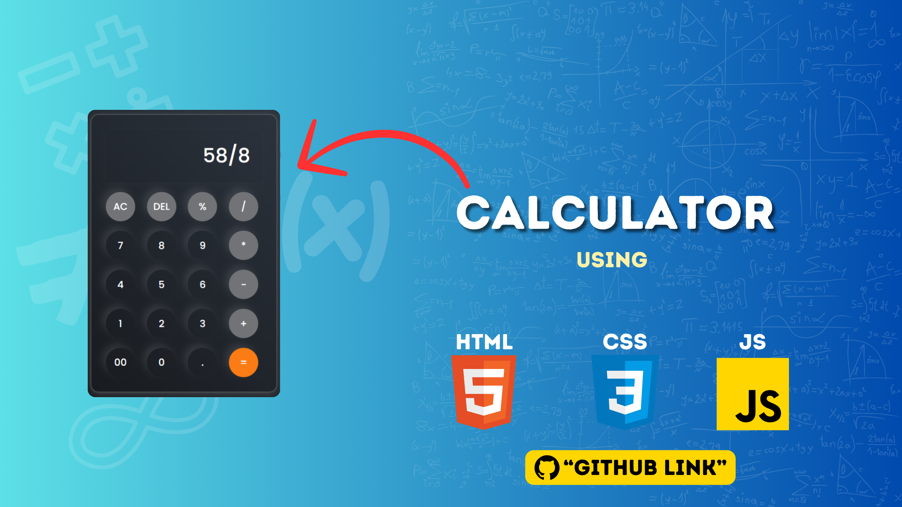
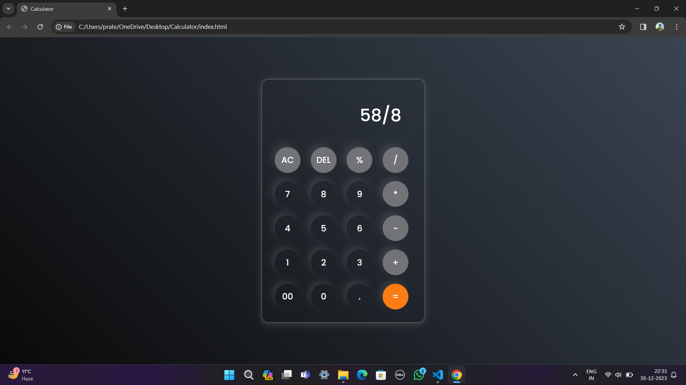

# Calculator
Building a calculator using HTML CSS and JavaScript. This is best JavaScript project for beginners. In this calculator, I created UI design using HTML and CSS then add calculator functionality with the help for simple JavaScript code.

[Visit Now 🚀]()

📌 Sneak Peek of Main Page 🙈 :

